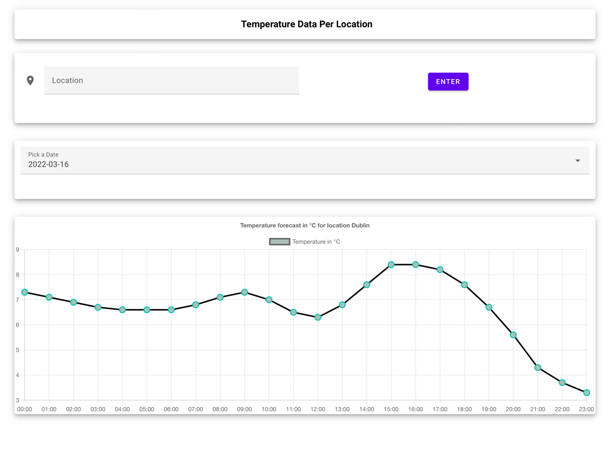

# Description
An API with its corresponding frontend to help user find temperature forecast for a given location. API is developed in Python or I would say FastAPI to be more specific. 
API has well-defined exception handling from validation exceptions to external api call exceptions, it can handle it all. All the critical part of API 
is well covered with set of unit tests. 
On the other hand, frontend is developed in JavaScript powered by Vue JS - a Javascript framework.

# How does it work!
Once user makes a request with specified location i.e. London, client app sends an API request with supplied location.
Information is passed as path parameter which gets validated once request hit the endpoint handler. Response is 400 if supplied information is invalid i.e. "---Dublin" or "-----".
If data is valid, API makes call to external API to get co-ordinates and cache this information in memcached. 
Caching is vital since external API can only allow certain number of request in given time hence proven to be a bottleneck. 
It is also make sense to store co-ordinates since they will never chance for a given place hence it will be faster to 
return a response for consecutive requests. Co-ordinates are then used to make another API request to get temperature data which is then returned in response to client with 200.

Client application handle transformation and visualisation of temperature data received from API. 
Data is grouped together by date and shown in a line chart as temperature vs hour. User can pick day from dropdown for which user is interested to see temperature forecast for which updates the chart imminently.



# Interested in running it locally?
* Cloning Repository
```shell
git clone https://github.com/yash-6795/Temeprature-by-Location-App.git
```

* Changing Directory
```shell
cd Temeprature-by-Location-App
```

* Build and run app using docker and docker-compose. Both Dockerfiles and docker-compose files is provided you just hit the below command to have application running on locahost.
```shell
docker-compose up
```

* Access the application on port 8080 of localhost
```shell
localhost:8080
```